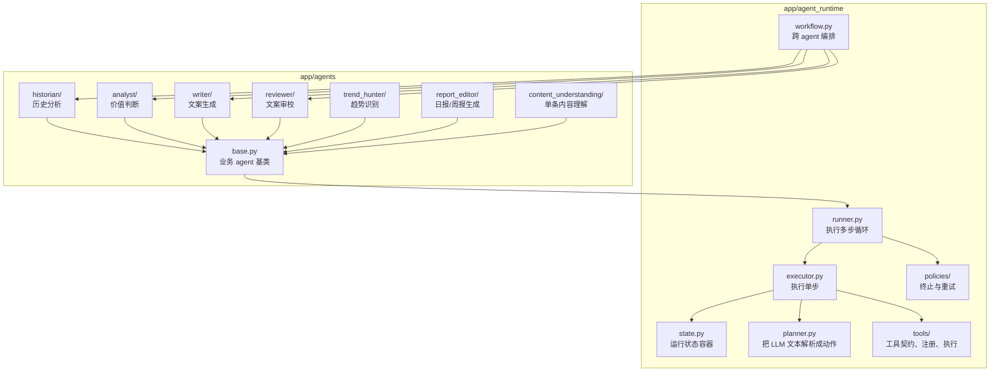
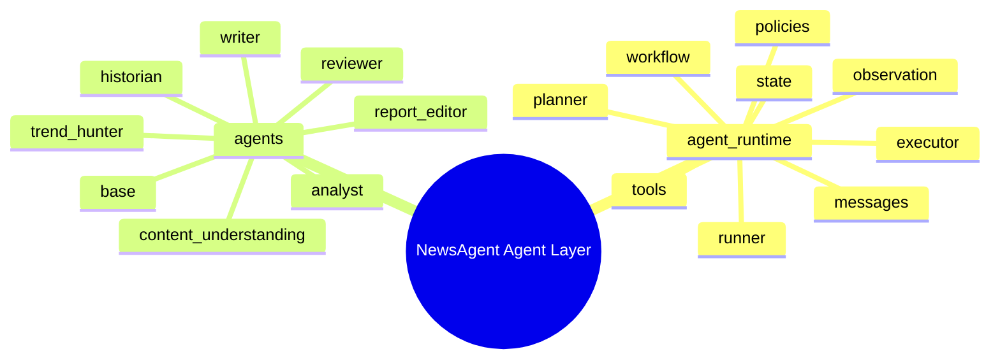

# Agent Runtime / Agents 学习索引

这套文档只做两件事：

1. 把 `app/agent_runtime` 和 `app/agents` 的结构画清楚。
2. 用解释文字把“代码是怎么跑起来的”讲明白。

这里不再铺整段源码。你学习时应该先看结构，再回到对应文件验证细节。

## 建议阅读顺序

1. `01_runtime_overview.md`
2. `02_runtime_execution.md`
3. `03_historian_analyst.md`
4. `04_writer_reviewer.md`
5. `05_trend_report.md`

## 顶层关系图

## 先建立一个总体认知

### 一句话概括 runtime

`agent_runtime` 是“让 LLM 按步骤运行起来”的执行框架。

它关心的是：

- 当前会话里有什么消息
- LLM 这一轮说的是最终答案、继续思考，还是要调工具
- 如果要调工具，怎么调、结果怎么写回状态
- 什么时候停下来

### 一句话概括 agents

`agents` 是“把具体业务问题塞进 runtime”的业务层。

它关心的是：

- 这个 agent 负责什么业务职责
- 它需要什么输入上下文
- 它输出什么结构化结果
- 它有没有专属工具
- 它在服务层怎么被调用

## 你阅读源码时要带着的 5 个问题

### 1. 谁负责业务，谁负责执行

- `BaseAgent` 以上是业务语义
- `AgentRunner` 以下是执行语义

### 2. LLM 每一轮到底输出什么

- 不是直接输出最终结果
- 而是先被 `planner.py` 解释成动作类型

### 3. tool 是谁定义、谁注册、谁执行

- `tools/base.py` 定义契约
- `tools/registry.py` 管注册
- `tools/executor.py` 管调用

### 4. service、builder、agent 三层怎么分工

- service：取数、拼装、调 agent
- input builder：把上下文压成 prompt-friendly 结构
- agent：拿 prompt 和 runtime 对接

### 5. 哪些地方已经成型，哪些地方还是半成品

- runtime 主链已经成型
- 多个业务 service 里仍有 stub / TODO
- tool 子系统的具体实现和契约之间还有不一致

## 模块地图

## 这套代码最值得先学懂的主链

如果你只想抓住主脉络，优先学下面这条链：

`BaseAgent.run()` -> `AgentRunner.run()` -> `StepExecutor.execute_step()` -> `parse_planner_response()` -> `ToolExecutor.execute()` -> `ObservationBuilder` -> `TerminationPolicy`

等你把这条链真正看懂，再回头看具体业务 agent，会轻松很多。
