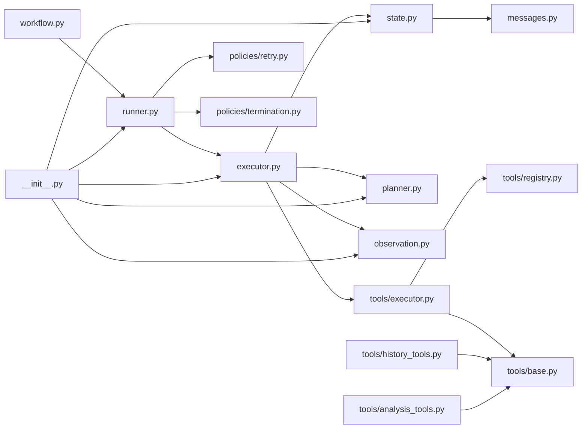
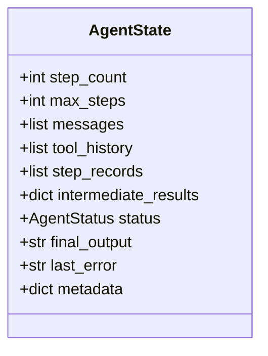
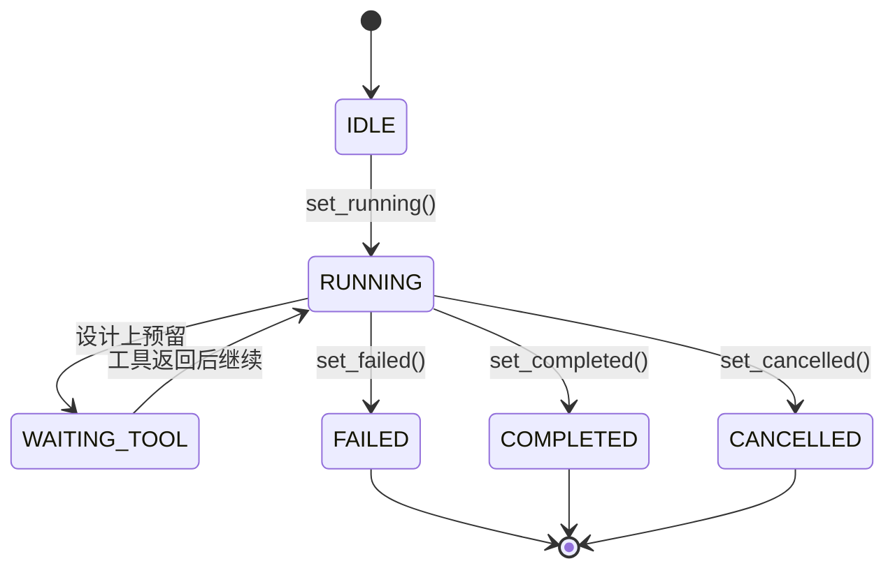
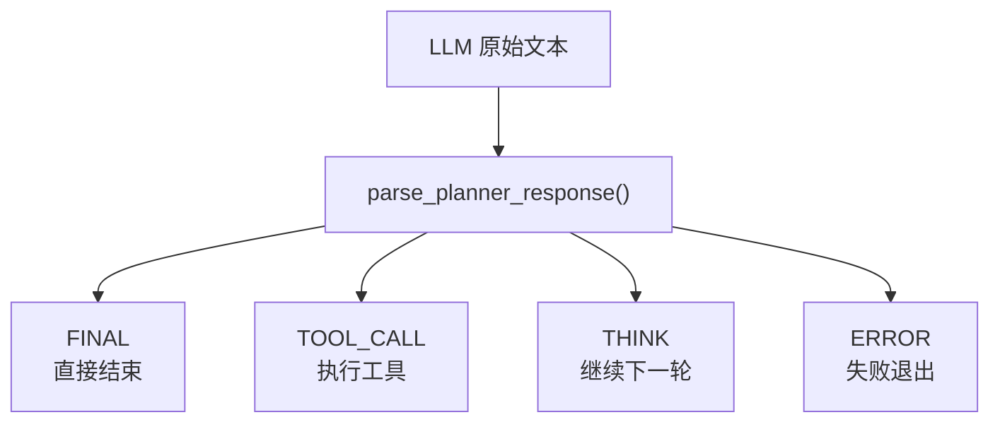
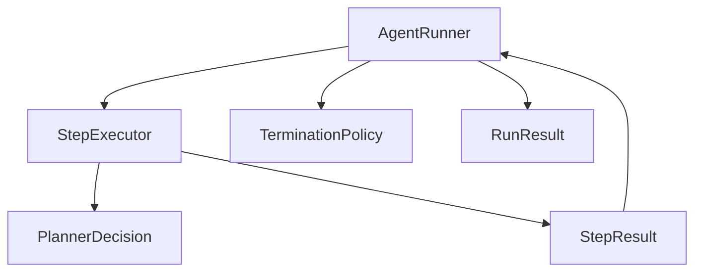
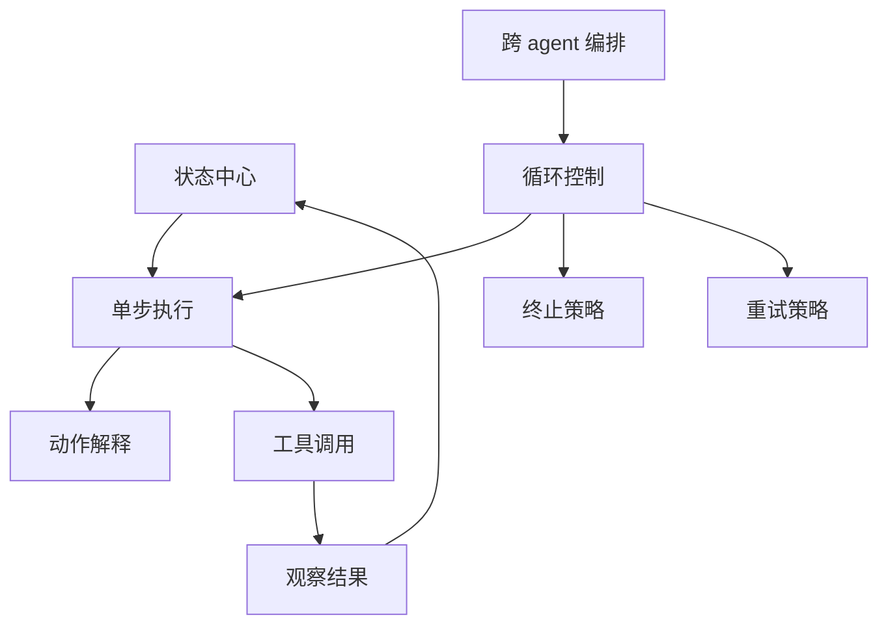

# Runtime 总览

这一篇只讲 `app/agent_runtime` 的静态结构，不讲长源码。

目标是先回答两个问题：

1. runtime 里每个文件负责什么
2. 它们彼此怎么连接

## 文件职责表

| 文件 | 角色 | 你应该怎么理解它 |
| --- | --- | --- |
| `messages.py` | 消息模型 | 把 system / user / assistant / tool / observation 统一成结构化消息 |
| `state.py` | 运行状态容器 | 保存 step 计数、消息历史、工具历史、最终结果 |
| `planner.py` | 动作解释器 | 把 LLM 返回文本解析成 `FINAL / TOOL_CALL / THINK / ERROR` |
| `observation.py` | 工具结果翻译层 | 把工具执行结果转成模型下一轮可读的文本 |
| `executor.py` | 单步执行器 | 负责“一轮 LLM + 可选工具调用” |
| `runner.py` | 多步循环执行器 | 负责持续跑多轮，直到终止 |
| `policies/retry.py` | 重试策略 | 定义失败后是否重试 |
| `policies/termination.py` | 终止策略 | 定义什么时候停 |
| `tools/base.py` | tool 契约 | 规定工具长什么样、怎么返回结果 |
| `tools/registry.py` | tool 注册中心 | 负责按名字找工具 |
| `tools/executor.py` | tool 调用器 | 真正去执行工具 |
| `tools/history_tools.py` | Historian 专属工具 | 给 Historian 提供历史信息查询能力 |
| `tools/analysis_tools.py` | Analyst 专属工具 | 给 Analyst 提供指标与判断查询能力 |
| `workflow.py` | 跨 agent 编排层 | 把多个 agent/service 串联成业务流程 |
| `__init__.py` | 包级导出层 | 对外集中暴露 runtime 的核心对象 |

## 依赖关系图

## runtime 的核心思想

### 1. 一切围绕 `AgentState`

runtime 真正的中心不是 `AgentRunner`，而是 `AgentState`。

原因很简单：

- `AgentRunner` 只是循环控制器
- `StepExecutor` 只是单步执行器
- `TerminationPolicy` 只是判断器
- 真正被大家共同读写的数据容器，是 `AgentState`

你可以把 `AgentState` 理解成“这次 agent 运行的工作内存”。

## `AgentState` 里最关键的字段

### 这些字段分别意味着什么

- `step_count` / `max_steps`
  用来控制循环上限，防止模型无限转圈。

- `messages`
  是给 LLM 的对话历史源头。

- `tool_history`
  是工具执行历史，不一定完整等于 `messages`，因为它更偏“结构化日志”。

- `step_records`
  是 trace 级记录，适合后续调试、可观测、回放。

- `intermediate_results`
  预留给复杂 agent 存中间结果，但当前代码里用得不重。

- `status`
  表示当前执行阶段，例如 `RUNNING`、`FAILED`、`COMPLETED`。

- `final_output`
  最终成功产物。

- `last_error`
  最近一次错误消息。

## 状态流转图

### 一个细节

`WAITING_TOOL` 这个状态在模型设计上存在，但当前主链里用得并不重。

这说明作者脑子里有“工具等待态”这个概念，但实现还没有完全围绕它展开。

## planner 在这套系统中的位置

很多人第一次看 runtime，会误以为 LLM 直接返回结构化业务结果。

这里不是。

这里的顺序是：

1. 先让 LLM 回一句文本
2. 再用 `planner.py` 判断这句文本属于哪种动作

## planner 动作图

### 为什么这么设计

优点：

- prompt 编写自由度高
- 不需要一开始就绑定严格 structured output

缺点：

- 解析脆弱
- 只要 prompt 漂一点，动作识别就可能偏掉

## `StepExecutor` 和 `AgentRunner` 的关系

这是 runtime 最重要的一对对象。

### `StepExecutor`

只负责“一步”：

- 拿当前 state
- 调 LLM
- 解析 decision
- 如果要调工具就调
- 把结果写回 state

### `AgentRunner`

负责“循环”：

- 初始化 state
- 重复调用 `StepExecutor`
- 每轮后问 `TerminationPolicy` 要不要停
- 最后汇总成 `RunResult`

## 关系图

## tool 子系统为什么要单独拆出来

因为作者想把“模型会不会调用工具”和“工具怎么执行”分开。

这会带来三个清晰边界：

1. `BaseTool`
   规定工具接口长什么样。

2. `ToolRegistry`
   规定工具怎么被发现。

3. `ToolExecutor`
   规定工具怎么被调用以及怎么包装结果。

这种分层是合理的。问题不在设计，而在具体 tool 的实现和契约没有完全对齐，这个在 `02_runtime_execution.md` 里会展开讲。

## `workflow.py` 为什么放在 runtime 里

严格说，它已经不只是 runtime。

它更像“基于 runtime 的业务编排层”。

作者把它放在这里，大概是想表达：

- 这不是纯业务 service
- 也不是底层 tool
- 它是多个 agent/service 的 orchestration

这个定位是能理解的，但从目录纯度来说，它其实也可以单独放到 `app/workflows`。

## 你现在应该形成的认知

看完这一篇后，你脑子里应该有这张图：

如果这张图你已经能在脑子里复述出来，就可以进下一篇看执行时序了。
