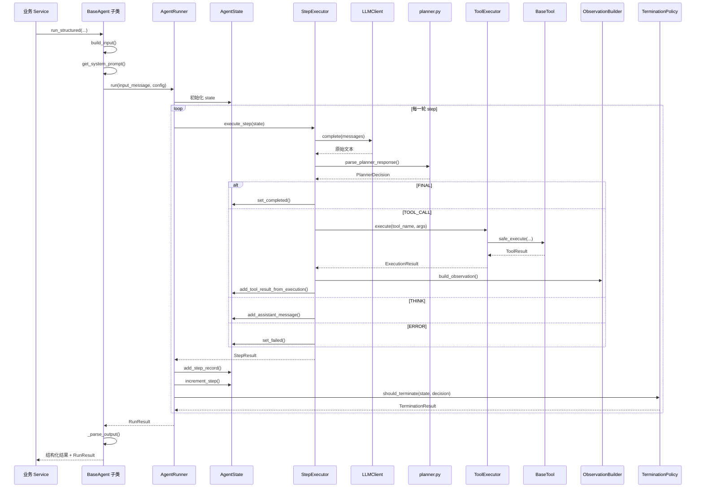
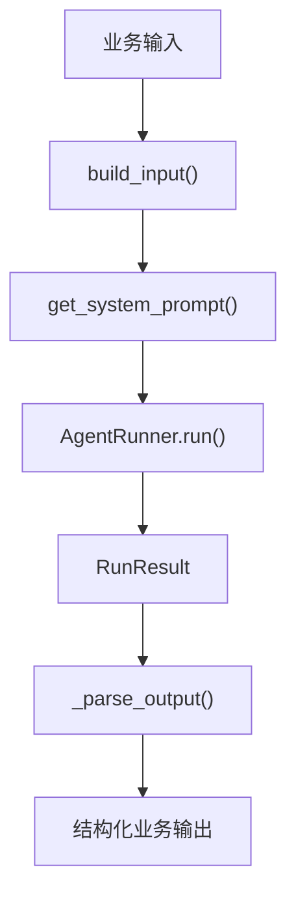
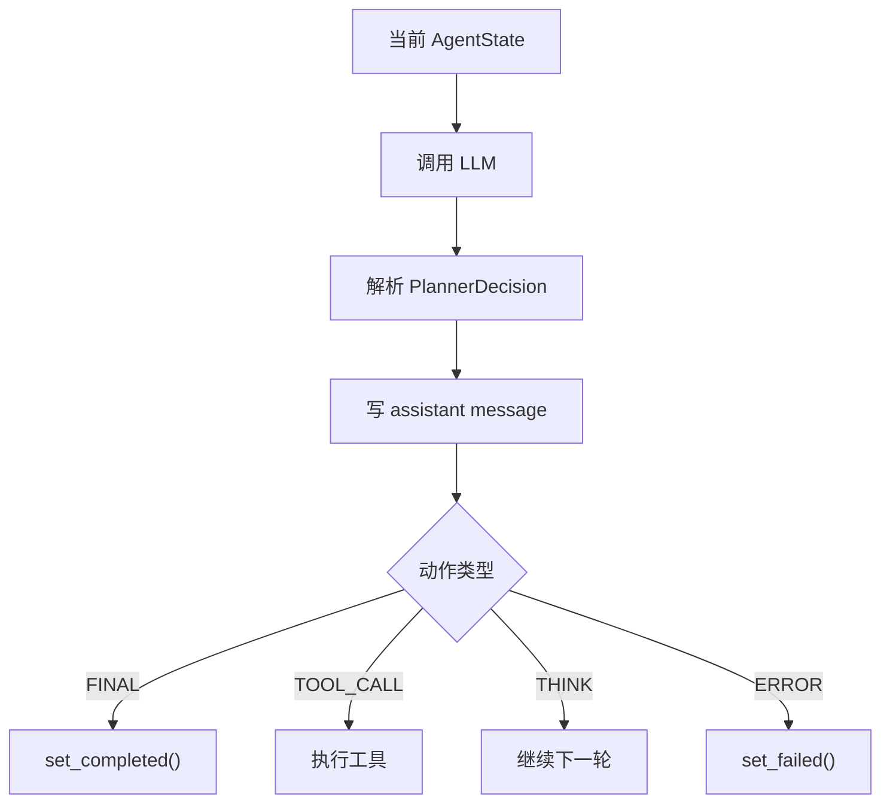
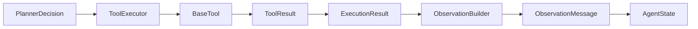
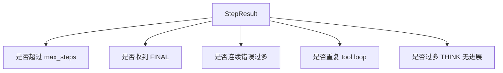
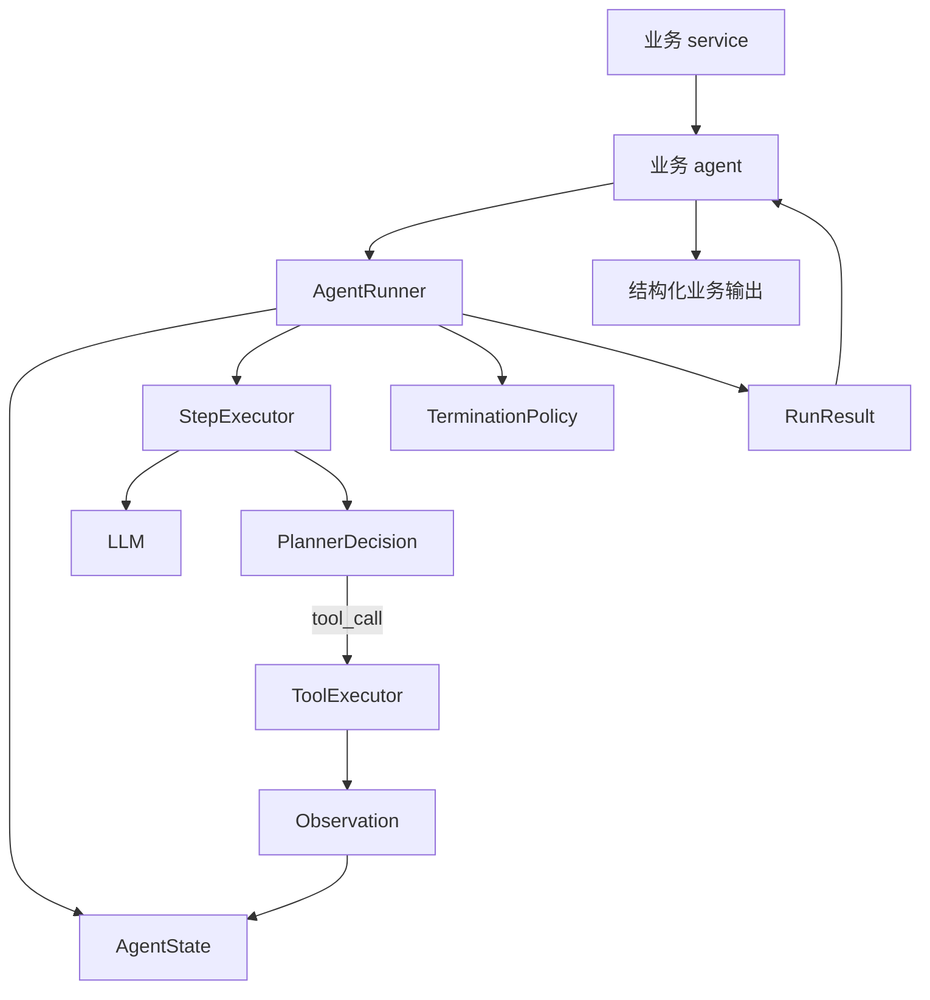

# Runtime 执行时序

这一篇不按文件拆，而是按“一次 agent 运行”来讲。

你真正要理解的是：

- 一次业务 agent 调用，底层发生了什么
- tool call 路径和非 tool 路径有什么区别
- 当前实现里有哪些关键设计点和缺口

## 主时序图

## `BaseAgent` 的位置

`BaseAgent` 是业务层进入 runtime 的统一入口。

它负责业务语义，不负责循环控制。

## `AgentRunner` 的职责

`AgentRunner` 是总控层，负责：

- 初始化或接管 `AgentState`
- 重复调用 `StepExecutor`
- 每轮后做终止判断
- 汇总成 `RunResult`
- 在更高层支持 retry

它不负责 prompt，也不负责工具逻辑。

## `StepExecutor` 的职责

`StepExecutor` 只负责“一步”。

一个关键细节：

即使这轮是 tool call，模型这轮说的话也会先写进消息历史。所以下一轮模型其实能看到自己上一轮是怎样做决策的。

## tool call 路径

这里最重要的不是“调工具”，而是“工具结果不会原样塞给模型”，而是先翻译成 observation 文本，再放回状态里。

## observation 的作用

`ObservationBuilder` 解决 3 件事：

- 把字符串、dict、list 这类不同输出格式统一成文本
- 在输出太长时做截断
- 决定要不要附带 metadata

这一步本质上是工具结果到模型上下文的翻译层。

## termination policy 的位置

真正决定停不停的是 `AgentRunner` 每轮尾部的 `TerminationPolicy`，不是 `StepExecutor`。

它不只是看步数，还在防：

- 重复工具死循环
- 一直 THINK 但没有进展

## retry policy 的位置

retry 不在单步里，而在 `run_with_retry()` 这层。

这说明作者把：

- 一次执行失败
- 是否整轮重跑

分开处理了。

## 当前实现里你必须知道的现实点

### 1. planner 还是启发式解析

没有真正强绑定 structured output，所以 prompt 或模型表达一漂，`TOOL_CALL` 可能掉成 `THINK`。

### 2. `WAITING_TOOL` 更像预留状态

状态设计完整，但主链还没有充分利用这个状态。

### 3. timeout 还没真正落地

`RunConfig.timeout_seconds` 和 `ToolExecutor` 的 timeout 参数都存在，但没有完整接线。

### 4. token usage 汇总还没做完

`runner.py` 已经有占位，但最终没有完整写回结果。

### 5. tool 契约和具体实现有偏差

设计契约是：

- `BaseTool.execute(**kwargs)`
- 返回 `ToolResult(output=...)`

但当前 `history_tools.py` 和 `analysis_tools.py` 里有不少实现写成：

- `execute(self, input_data: dict[str, Any])`
- 返回 `ToolResult(data=...)`

这和 runtime 契约不一致，按当前主链直接运行，有报错风险。

## `workflow.py` 的角色

runtime 主链解决“一个 agent 怎么跑”。

`workflow.py` 解决“多个 agent/service 怎么串”。

例如：

- `HistorianThenAnalystWorkflow`
- `WriteThenReviewWorkflow`
- `ParallelAgentWorkflow`

这些对象关心的是步骤依赖，而不是单轮 LLM 调用细节。

## 你最后要记住的主链

如果你能把这张图顺着讲清楚，runtime 主链就算真正入门了。
