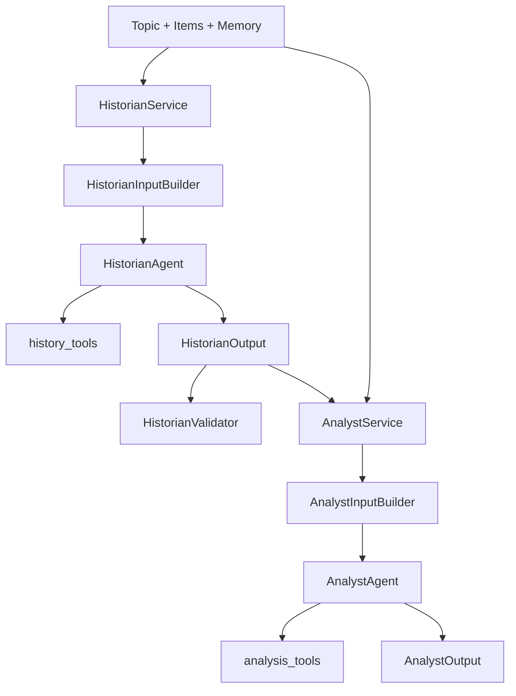
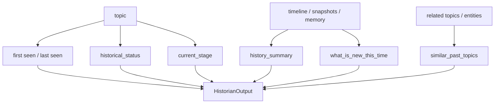
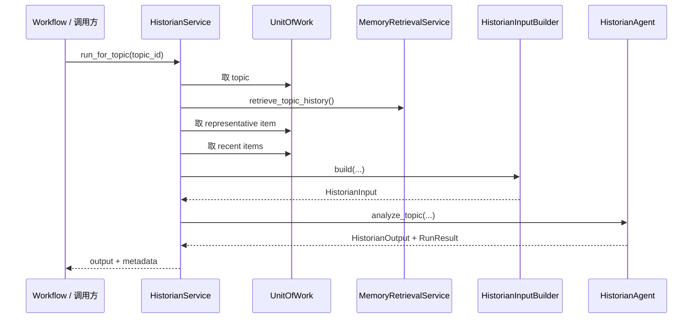
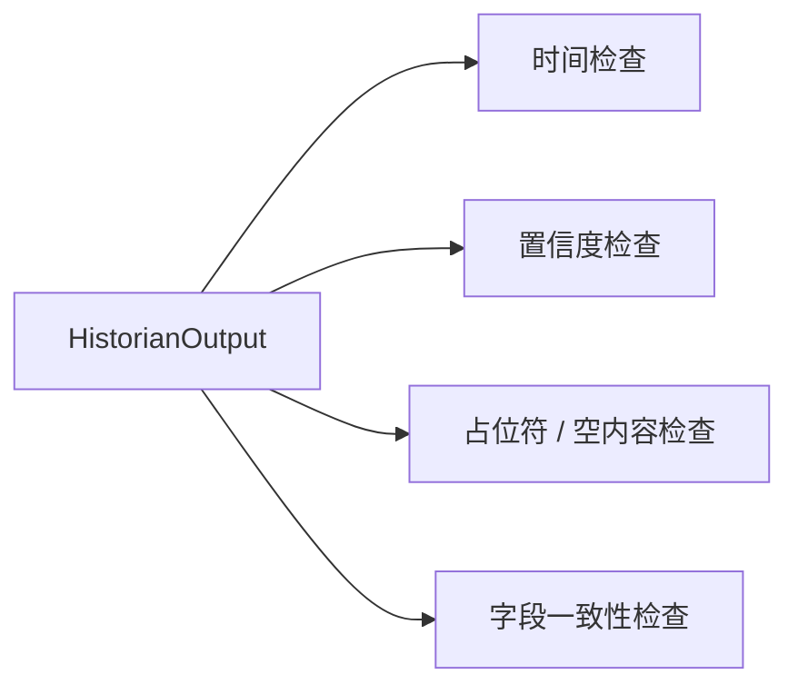
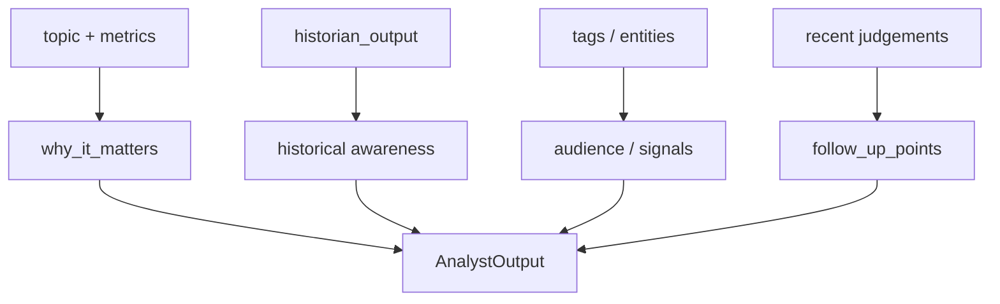
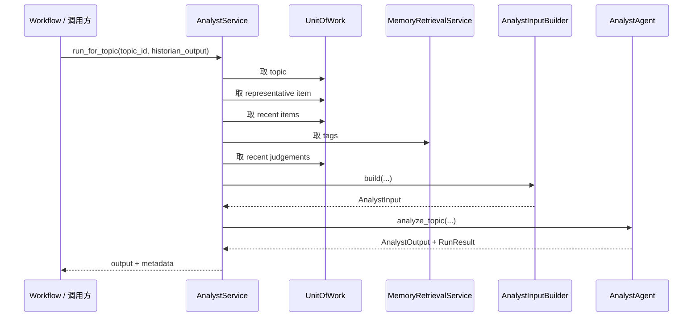
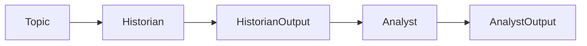

# Historian / Analyst 讲解

这一组是项目里最像“研究分析双引擎”的部分。

你可以把它理解成：

- `Historian` 负责回答“这件事过去是什么、现在和过去相比有什么变化”
- `Analyst` 负责回答“这件事为什么重要、对谁重要、接下来该盯什么”

## 总体关系图

## 分层结构

### service 层

- `HistorianService`
- `AnalystService`

负责：取数据、组输入、调 agent、回传 metadata。

### input builder 层

- `HistorianInputBuilder`
- `AnalystInputBuilder`

负责：把数据库对象、历史上下文、最近 items、tags 等内容压成 prompt 友好的输入模型。

### agent 层

- `HistorianAgent`
- `AnalystAgent`

负责：选择 prompt、选择工具、指定输出 schema，并调用 runtime。

### schema 层

- `HistorianInput` / `HistorianOutput`
- `AnalystInput` / `AnalystOutput`

负责：定义模型输入输出边界。

## Historian 的职责

Historian 不是新闻摘要器，它更像“带时间轴的解释器”。

它要回答的是：

- 这件事是不是第一次出现
- 如果不是，这次和以前相比新在哪里
- 它是持续演进、重复回潮，还是里程碑事件

## Historian 执行链

### 为什么 Historian 输入复杂

因为它不只看当前 topic 标题，还要看：

- topic 当前指标
- recent items
- timeline
- snapshot
- existing memory
- similar past topics

所以 `HistorianInputBuilder` 实际上是在做“上下文压缩和统一格式化”。

## Historian 输出设计

核心字段包括：

- `first_seen_at`
- `last_seen_at`
- `historical_status`
- `current_stage`
- `history_summary`
- `timeline_points`
- `what_is_new_this_time`
- `similar_past_topics`
- `important_background`
- `historical_confidence`

这说明 Historian 输出同时服务于：展示层、后续 Analyst、后续 Writer/Reviewer，以及未来 memory 更新。

## HistorianValidator 的意义

它说明作者知道一件事：

schema 只能保证“形状对”，不能保证“内容真的合理”。

所以 Validator 是 LLM 输出之后的第二道保险。

## Analyst 的职责

Analyst 不是再讲一遍 Historian。

- Historian 关注时间维度
- Analyst 关注价值维度

它回答的是：

- 为什么重要
- 对谁重要
- 趋势处于什么阶段
- 下一步应该继续看什么

## Analyst 执行链

## Historian -> Analyst 这条链

这条链的意义是：

先由 Historian 负责背景和时间解释，再由 Analyst 基于这份背景做价值判断。

这是一种很清楚的“先事实、后判断”分层。

## 对应 workflow

`HistorianThenAnalystWorkflow` 就是在系统里把这条依赖链显式编码出来。

它的价值是：

- 固化执行顺序
- 明确 Analyst 依赖 Historian
- 用统一 `WorkflowResult` 包装整个流程结果

## 当前实现里要注意的现实点

### 1. 这组代码结构是成熟的

从分层角度看，这是项目里最清晰的一组代码。

### 2. 数据接线还不完整

- entity retrieval 还是 TODO
- 某些上下文字段还没补齐

### 3. tools 契约有偏差

设计上支持 tools，但具体 tool 实现和 runtime 的 `BaseTool` 契约没有完全对齐。

### 4. metadata 做得不错

两个 service 都会返回：

- started_at
- completed_at
- duration_ms
- success
- run_status

这对调试和观测很有用。

## 学这组代码时的正确顺序

1. 先看 `schemas.py`
2. 再看 `input_builder.py`
3. 再看 `agent.py`
4. 最后看 `service.py`
5. 看完再回 `workflow.py`

## 最后记一句话

Historian 负责“时间解释”，Analyst 负责“价值解释”；两者通过 workflow 串成一条先背景、后判断的分析链。
