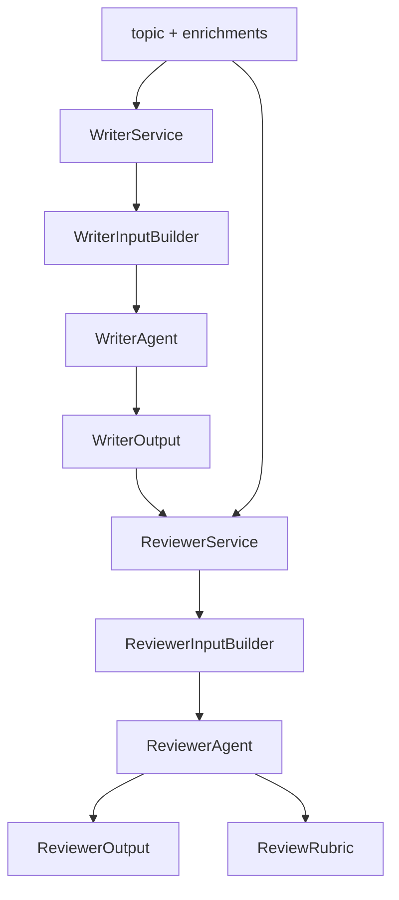
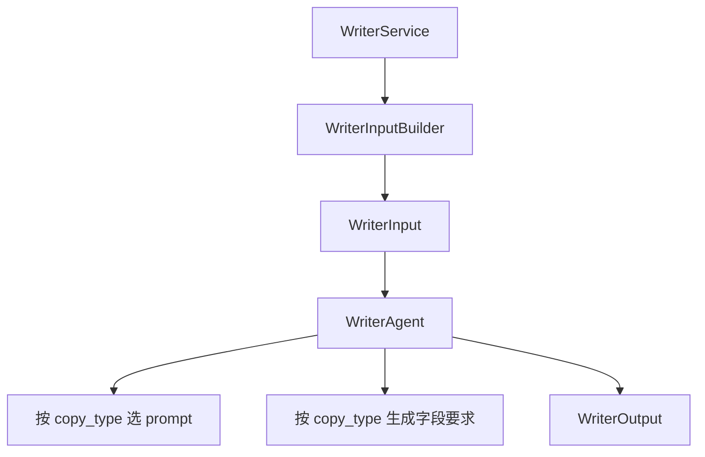
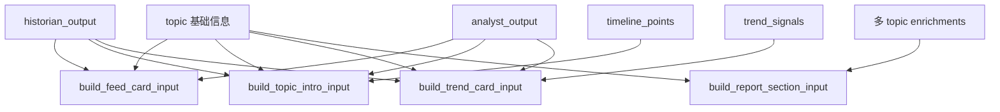
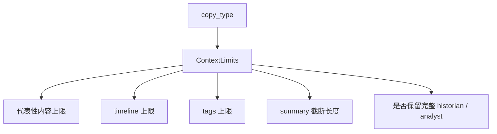
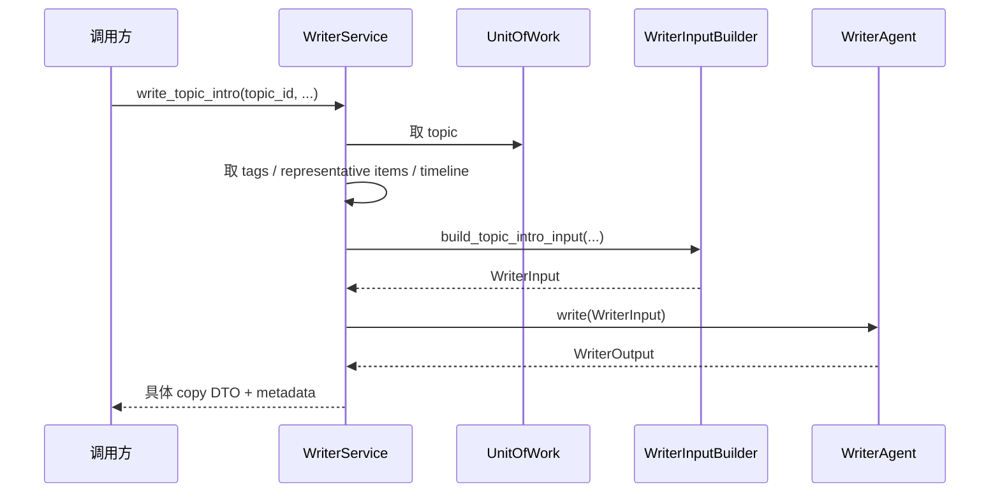
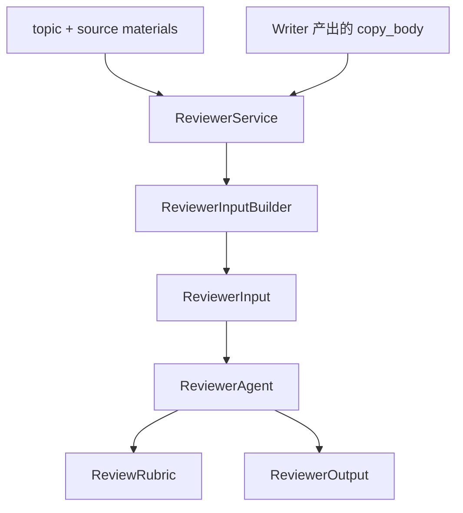
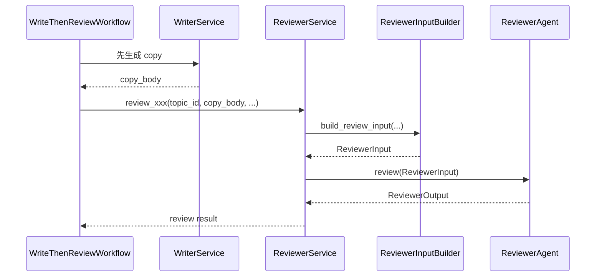

# Writer / Reviewer 讲解

这一组代码代表的是“生产内容”和“审查内容”两套能力。

你可以把它理解成：

- `Writer` 负责把结构化上下文转成可发布文案
- `Reviewer` 负责拿同样的上下文去检查 Writer 产出的文案是否靠谱

## 总体关系图

## Writer 的定位

Writer 不是自由写作 agent，而是“受上下文约束的文案生成器”。

### 它要生成的 4 类文案

| copy type | 用途 | 对应 schema |
| --- | --- | --- |
| `feed_card` | 列表卡片短文案 | `FeedCardCopyDTO` |
| `topic_intro` | topic 详情页开场 | `TopicIntroCopyDTO` |
| `trend_card` | 趋势卡片 | `TrendCardCopyDTO` |
| `report_section` | 报告段落 | `ReportSectionCopyDTO` |

## Writer 内部结构

### 为什么 Writer 用一个类承载多种文案

因为这些文案共享：

- 同一类 topic 上下文
- 同一类 Historian / Analyst enrichments
- 同一套 runtime 执行框架

不同点主要是：

- 输出字段不同
- prompt key 不同
- 输入上下文侧重点不同

## WriterInputBuilder 的作用

Builder 的价值是把“不同 copy type 的上下文差异”集中起来，而不是让 agent 里到处写分支。

## WriterContextPolicy 的意义

这是一个设计意图很好的模块。

它想表达的是：

- `feed_card` 不应该吃太多上下文
- `topic_intro` 应该有更多背景
- `report_section` 要处理多 topic 组合

### 当前现实

这套策略对象已经有了，但 Writer 主流程没有完整接上 `apply_limits()`。

所以它目前更像“设计已到位、接线待补”的模块。

## WriterAgent 的作用

它本质上做 3 件事：

1. 根据 `copy_type` 决定 prompt key
2. 根据 `copy_type` 决定输出字段要求
3. 把 `WriterInput` 交给 runtime 去跑

### Writer prompt 的核心约束

Writer 在 prompt 里被要求：

- 不能发明事实
- 不能和 Historian 矛盾
- 不能和 Analyst 矛盾
- 要专业、具体

这说明它不是创意写手，而是“受证据约束的生成器”。

## WriterService 的角色

它很像 façade。

### 当前现实

`_get_topic_tags()`、`_get_representative_items()`、`_get_timeline_points()` 里还有 stub。

也就是说，Writer 框架成型了，但上下文供给还没完全接满。

## Reviewer 的定位

Reviewer 不是简单打分器，而是结构化审稿器。

它要回答：

- 这段文案有没有事实错误
- 有没有和 Historian / Analyst 输出冲突
- 有没有证据不足的说法
- 有没有漏掉关键点
- 是 approve、revise 还是 reject

## Reviewer 结构图

## ReviewRubric 的价值

rubric 把“审稿标准”单独建模出来了。

它分两层：

1. 通用核心项 `CORE_RUBRIC`
2. copy type 专属要求 `COPY_TYPE_REQUIREMENTS`

这相当于把审稿规则从 prompt 文本里抽成了配置层。

## ReviewerInputBuilder 的作用

它的核心不是搬字段，而是组织证据。

它会把：

- copy_body
- Historian 输出
- Analyst 输出
- representative items
- timeline points

拼成一个适合审稿的上下文，并提取 `key_evidence`。

## 审稿时序图

## `WriteThenReviewWorkflow` 的意义

这是标准的两阶段流水线：

1. Writer 生成内容
2. Reviewer 回看内容

这样做的价值是：

- 形成默认的“生成后复查”路径
- 用统一 `WorkflowResult` 包装整条链路
- 更容易做失败定位和重跑

## 当前实现里要注意的现实点

### 1. Writer 架构清晰，但数据接线不完整

上下文源仍有不少 stub。

### 2. WriterContextPolicy 设计存在，但未完全接线

这是典型的“结构先行、落地稍后”。

### 3. Reviewer 规则体系比数据体系成熟

rubric 很清楚，但 evidence 数据供给还不够强。

### 4. ReviewerService 也有 stub

representative items 和 timeline points 目前还是空实现。

## 学这组代码时的正确顺序

1. 先看 schema
2. 再看 builder
3. 再看 agent
4. 最后看 service 与 workflow

## 最后记一句话

Writer 负责“把上下文写成内容”，Reviewer 负责“把内容拉回证据和规则上检查一遍”。
