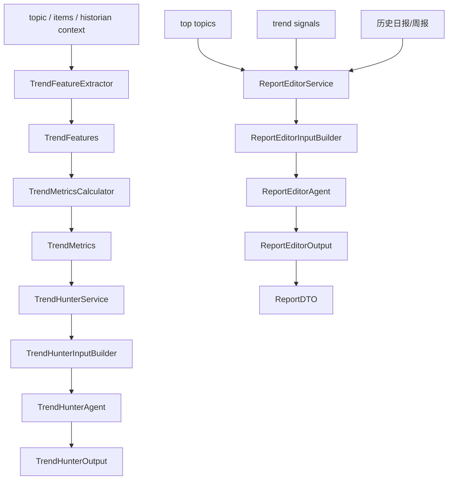
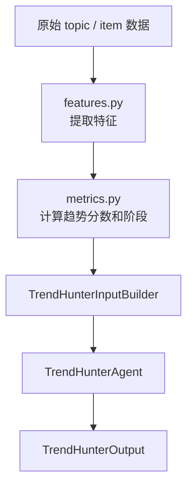
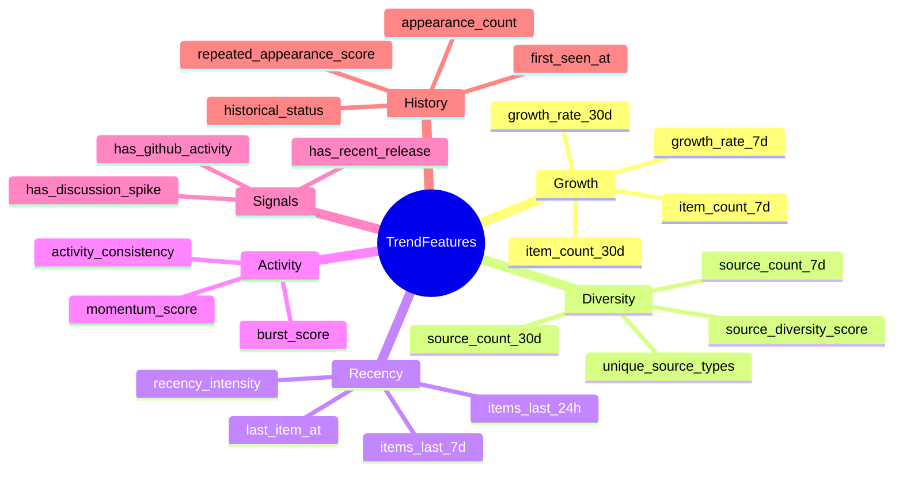
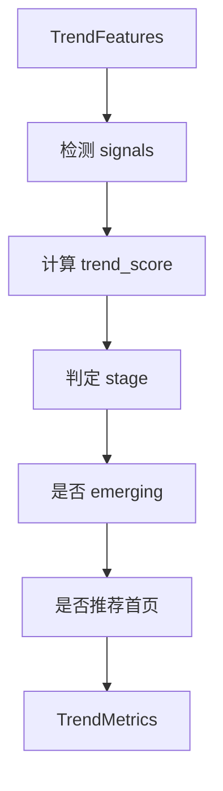
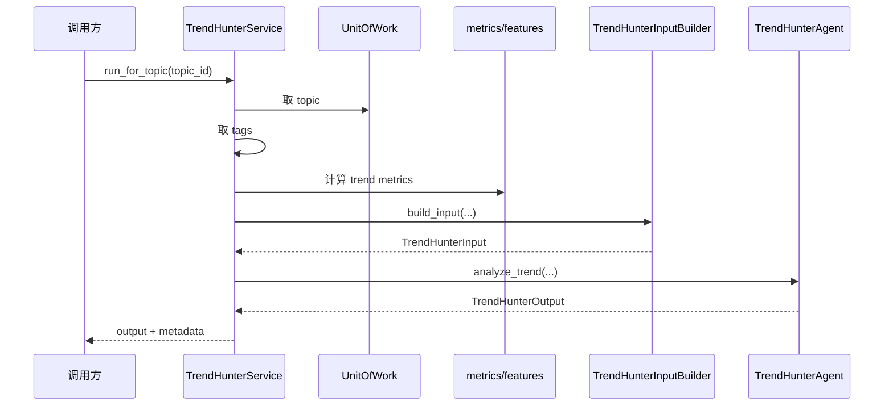
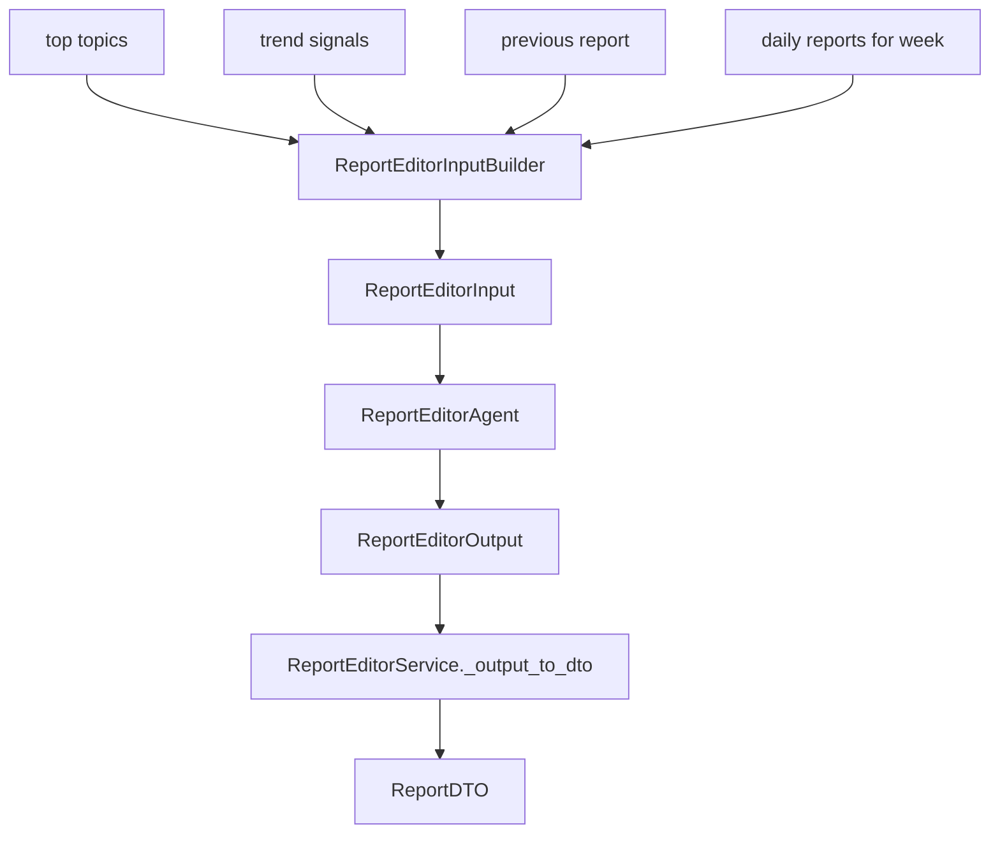
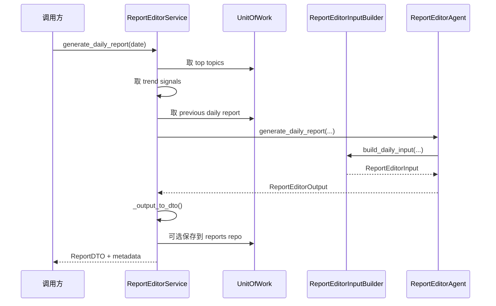

# TrendHunter / ReportEditor 讲解

这一组更像“专题分析与汇编层”。

它和 `Historian/Analyst`、`Writer/Reviewer` 的区别在于：

- `TrendHunter` 重点是趋势识别
- `ReportEditor` 重点是把多个 topic 汇成日报/周报

## 总体关系图

## 你应该先建立的认知

### `TrendHunter`

它不是纯 LLM agent，而是两层结构：

1. 规则/指标层：`features.py` + `metrics.py`
2. LLM 表达层：`TrendHunterAgent`

### `ReportEditor`

它也不是简单写作器，而是：

- 先选 topic
- 再整理信号
- 再让一个“总编型 agent”做汇编

## TrendHunter 的结构分层

## 为什么 TrendHunter 值得单独学

因为它把“传统工程规则计算”和“LLM 描述总结”放在了一起。

### 规则层负责

- 提取趋势特征
- 计算增长、来源多样性、recency、burst 等指标
- 决定 trend score、stage、signals

### LLM 层负责

- 把这些指标解释成自然语言
- 给出 `why_now`
- 给出 `follow_up_watchpoints`

## `features.py` 在做什么

它做的是“原始数据 -> 特征向量”。

它的价值在于：先把趋势证据代码化，再让 LLM 去解释，而不是让 LLM 直接拍脑袋。

## `metrics.py` 在做什么

它做的是“特征 -> 趋势判断”。

核心输出包括：

- `trend_score`
- `stage`
- `signals`
- `is_emerging`
- `recommended_for_homepage`
- `confidence`

## TrendHunterAgent 的位置

它本身很薄。

它不负责：

- 原始数据计算
- feature engineering
- score 计算

它负责：

- 接收整理好的趋势输入
- 用 prompt 把这些输入转成结构化趋势说明

所以如果你想知道“为什么被判成趋势”，先看 `features.py` 和 `metrics.py`，再看 `agent.py`。

## TrendHunterService 的位置

它是把规则层和 agent 层接起来的 service。

### 当前现实

`TrendHunterService` 里不少方法还是 stub：

- `_get_topic_tags()`
- `_compute_trend_metrics()`
- `_get_recent_active_topics()`

所以趋势规则组件写得不算少，但 service 数据接线还没补完。

## ReportEditor 的定位

`ReportEditor` 更像“总编 agent”。

它不是写单条 topic 文案，而是把一组 topic 组织成一份汇总报告。

它关心的是：

- 哪些 topic 要进报告
- 哪些趋势信号要强调
- 和上一份报告相比有没有连续性

## ReportEditor 结构图

## `ReportEditorInputBuilder` 在做什么

它不是简单拼字段，而是在整理“报告素材包”。

### daily report 输入

- top topics
- trend signals
- key insights
- important releases
- important discussions
- previous report 摘要和 watch items

### weekly report 输入

在上面的基础上再加：

- week_start / week_end
- daily reports 聚合
- previous weekly report

## ReportEditorAgent 的角色

它负责把“报告素材包”转成一份结构化报告。

输出内容包括：

- report title
- executive summary
- key highlights
- sections
- editorial conclusion
- watch_next_week

它不像 Writer 那样生成内容片段，而更像“多 topic 汇编器 + 编辑总结器”。

## ReportEditorService 的执行链

## 当前实现里要注意的现实点

### 1. TrendHunter 是“规则层成熟度高于 service 层”

`features.py` 和 `metrics.py` 已经有实质内容，但 service 层接线还不完整。

### 2. ReportEditor 是“agent 层成熟度高于数据层”

输入输出 schema 和 agent 结构很清楚，但：

- trend signals 还是 stub
- weekly daily reports 聚合还是 stub

### 3. 两组代码都很适合继续工程化

因为它们的分层已经有了：

- 数据层
- builder 层
- agent 层
- DTO 转换层

真正缺的是：

- 数据接线补齐
- 类型边界继续收紧
- 端到端测试补足

## 最后记两句话

### 对 TrendHunter

真正的趋势判断核心不在 prompt，而在 `features.py` 和 `metrics.py` 这条规则链。

### 对 ReportEditor

它不是写一条 topic 文案，而是在把一组 topic 组织成一份可交付的编辑报告。
